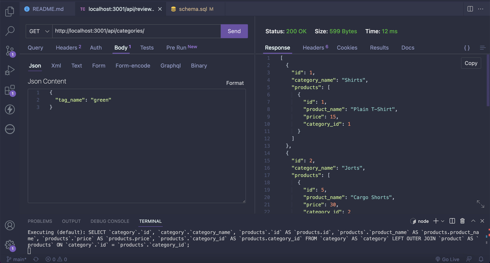

# E-Commerce-Back-End

## Overview

A back end application that uses sequelize to get, post, put, and delete data from a database

## Skills

-JavaScript\
-Nodejs\
-SQL\
-Sequelize

## Screenshot

## Video

